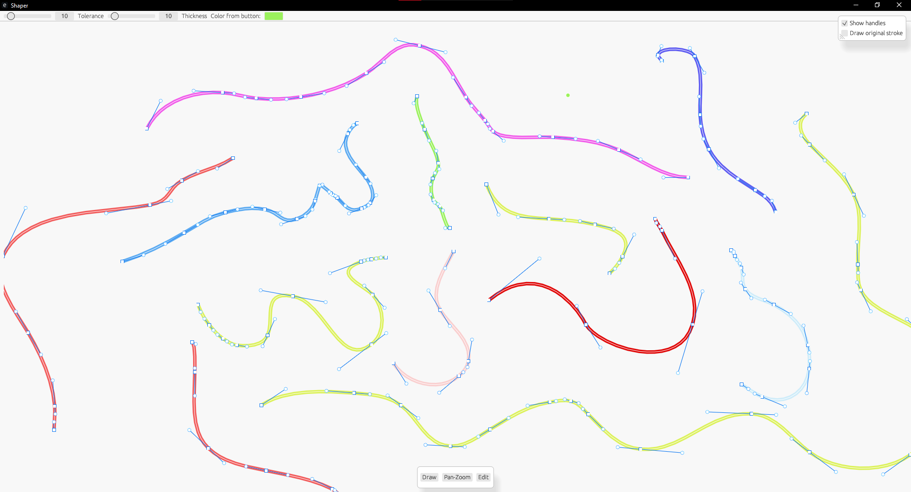

# SHAPER
### (early development) Freehand drawing tool that turns strokes into bezier for fine editing.  

<!--  -->

## How to build:
1. Install Cargo (and rust) if you haven't already.
2. Clone repo.
3. run `cargo build`

_or if you only want to run it_
1. Install Cargo (and rust) if you haven't already. 
2. Clone repo.  
3. run `cargo run`  

## TO-DO:
1. Add "edit-shape" tool to allow to allow the user to edit the created shapes.
2. Create proper UI to make the user able to create a Canvas with a fixed height and width (instead of the currently inifinite canvas). 
3. Export functionality including SVG and  image formats like PNG, JPEG.

## GOAL:
- Become a solid production ready curve editing tool
- Export to at least (some) widely used formats like: Image, SVG, raw points, etc..

## License
######  _I do not care about licensing, but many prefer to have it in the repo, so:_
This project is dual-licensed under either:

* **MIT License** ([LICENSE-MIT](LICENSE-MIT))
* **Apache License, Version 2.0** ([LICENSE-APACHE](LICENSE-APACHE))

at your option.

## dependencies:
- eframe (& egui)
- kurbo
- simplify-rs
